``` r
# knitr
library("knitr")
opts_chunk$set(fig.width=8, fig.height=5, cache=TRUE)

# ggplot
library("ggplot2")
theme_set(theme_minimal())
update_geom_defaults("bar", list(fill = "black"))
update_geom_defaults("line", list(colour = "red"))
update_geom_defaults("line", list(fill = "black", colour = "black"))

# other packages
requireNamespace("bib2df", quietly = TRUE)
requireNamespace("igraph", quietly = TRUE)
requireNamespace("gender", quietly = TRUE)
requireNamespace("ggraph", quietly = TRUE)
```

License: Public Domain (CC-0)

This is the bibtex (.bib) file containing all of my bibliographic references. Figured I'd share it publicly.

This README was last updated on 2019-04-22.

``` r
dat <- suppressWarnings(bib2df::bib2df("references.bib"))
```

    ## Column `YEAR` contains character strings.
    ##               No coercion to numeric applied.

``` r
suppressWarnings(dat[["YEAR"]] <- as.numeric(dat[["YEAR"]]))
```

The database contains 4209 references. What follows are some basic statistics on its contents.

Citation Types
--------------

Reference types in the database:

``` r
dat$CATEGORY <- factor(dat$CATEGORY, levels = names(sort(table(dat$CATEGORY))))
ggplot(dat[!is.na(dat$CATEGORY),], aes(x = CATEGORY)) + 
  geom_bar() + 
  xlab("Count") + 
  ylab("Citation Type") + 
  coord_flip()
```

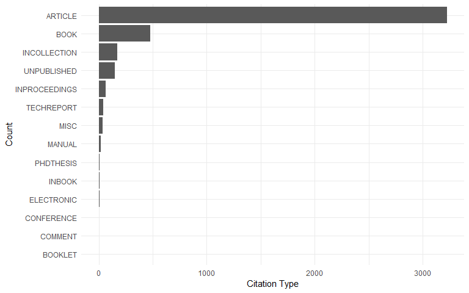

Journals
--------

Most common 50 journals:

``` r
dat$JOURNAL[is.na(dat$JOURNAL)] <- dat$JOURNALTITLE[is.na(dat$JOURNAL)]
topjournals <- aggregate(CATEGORY ~ JOURNAL, data = dat, FUN = length)
topjournals <- head(topjournals[order(topjournals$CATEGORY, decreasing = TRUE), ], 50)
topjournals$JOURNAL <- factor(topjournals$JOURNAL, levels = rev(topjournals$JOURNAL))
ggplot(topjournals, aes(x = JOURNAL, y = CATEGORY)) + 
  geom_bar(stat = "identity") + 
  ylab("Count") + 
  xlab("Journal") + 
  coord_flip()
```

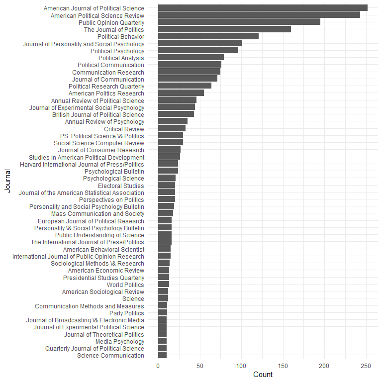

Book Publishers
---------------

Most common 25 journals:

``` r
toppublishers <- aggregate(CATEGORY ~ PUBLISHER, data = dat[dat$CATEGORY == "BOOK",], FUN = length)
toppublishers <- head(toppublishers[order(toppublishers$CATEGORY, decreasing = TRUE), ], 25)
toppublishers$PUBLISHER <- factor(toppublishers$PUBLISHER, levels = rev(toppublishers$PUBLISHER))
ggplot(toppublishers, aes(x = PUBLISHER, y = CATEGORY)) + 
  geom_bar(stat = "identity") + 
  ylab("Count") + 
  xlab("Publisher") + 
  coord_flip()
```

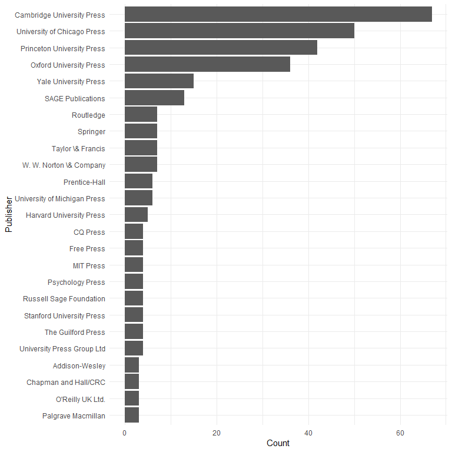

Authors
-------

Number of coauthors per publication (excluding some recent extreme outliers):

``` r
dat$nauthors <- lengths(dat$AUTHOR)
ggplot(dat[!is.na(dat$YEAR) & dat$YEAR > 1900 & dat$nauthors < 40, ], aes(x = YEAR, y = nauthors)) + 
  geom_point(alpha=0.1, fill="black", colour="black") + 
  geom_smooth(method = "gam", colour = "red") + 
  xlab("Publication Year") + 
  ylab("Coauthors per Publication")
```

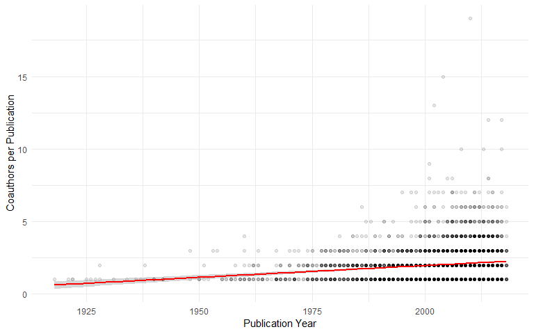

Most common 50 authors:

``` r
aut <- unlist(dat$AUTHOR)
topaut <- as.data.frame(head(sort(table(aut), decreasing = TRUE), 150))
topaut$aut <- factor(topaut$aut, levels = rev(topaut$aut))
ggplot(topaut[1:50, ], aes(x = aut, y = Freq)) + 
  geom_bar(stat = "identity") + 
  ylab("Count") + 
  xlab("Author Name") + 
  coord_flip()
```

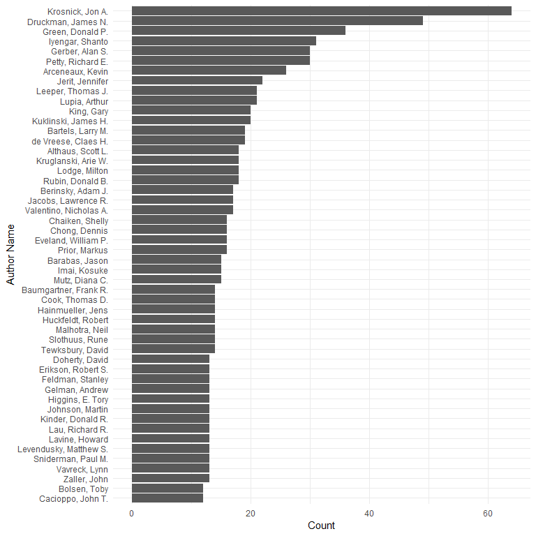

Gender of authors
-----------------

The overall breakdown of author genders (counting each author only once) is as follows:

``` r
pull_first_names <- function(x) {
    x <- unlist(regmatches(as.character(x), regexec("(?<=, )[A-Za-z]+(?=([., ]{1}|$))", as.character(x), perl = TRUE)))
    x[x != ""]
}
first_names <- pull_first_names(unique(as.character(unlist(dat$AUTHOR))))
author_genders <- gender::gender(unlist(first_names))

ggplot(author_genders[, "gender", drop = FALSE], aes(x = "", fill = gender)) +
  geom_bar(aes(y = (..count..)/sum(..count..)), width = 1, position = "dodge") + 
  scale_fill_manual(limits = c("male", "female"), values = c("gray", "black")) +
  scale_y_continuous(breaks = seq(0,1,by=0.1), labels = scales::percent) +
  coord_flip() +
  xlab("") +
  ylab("") +
  theme(legend.position = "bottom")
```

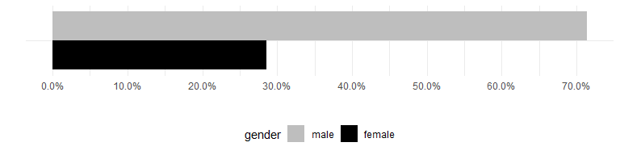

``` r
team_genders <- unlist(lapply(dat$AUTHOR, function(x) {
    firsts <- pull_first_names(as.character(x))
    u <- author_genders$gender[match(firsts[firsts != ""], author_genders$name)]
    if (!length(u) || is.na(u)) {
        "Ambiguous"
    } else if (length(u) == 1 && u == "male") {
        "Male Solo"
    } else if (length(u) == 1 && u == "female") {
        "Female Solo"
    } else if (all(u %in% "male")) {
        "Male Team"
    } else if (all(u %in% "female")) {
        "Female Team"
    } else {
        "Male-Female Team"
    }
}))
team_genders_df <- table(factor(team_genders, rev(c("Male-Female Team", "Male Solo", "Female Solo", "Male Team", "Female Team", "Ambiguous"))))
ggplot(data.frame(team_genders_df), aes(x = Var1, y = Freq)) +
  geom_bar(width = 1, position = "dodge", stat = "identity") + 
  coord_flip() +
  xlab("") +
  ylab("")
```

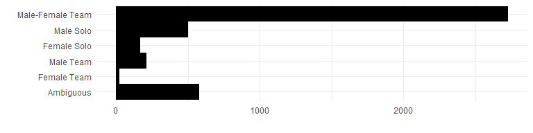

Caveat: The above is based upon [the gender package](https://cran.r-project.org/package=gender), which classifies first names based upon historical data. This is not necessarily accurate and is restricted to a binary classification. It also uses all historical data provided in the package and is based only on United States data, making it possibly inaccurate for any given individual in the dataset.

Coauthorship
------------

Coauthorship network among most common 150 authors:

``` r
# get all coauthor pairs
colist <- lapply(dat$AUTHOR, function(x) if (length(x) >= 2) combn(x, m = 2) else NA_character_)
# convert networks of top coauthors to igraph object
codat <- na.omit(data.frame(t(do.call("cbind", colist))))
codat$N <- 1L
# make coauthor graph from top coauthors
topco <- aggregate(N ~ X1 + X2, data = codat[codat$X1 %in% topaut$aut & codat$X2 %in% topaut$aut, ], FUN = sum)
cograph <- igraph::graph_from_data_frame(topco, directed = FALSE)

## ggraph
ggraph::ggraph(cograph, "igraph", algorithm = "nicely") + 
  ggraph::geom_edge_link(aes(edge_width = log(N)), colour = "gray") + 
  ggraph::geom_node_text(aes(label = name), fontface = 1, size = 2) + 
  theme_void()
```

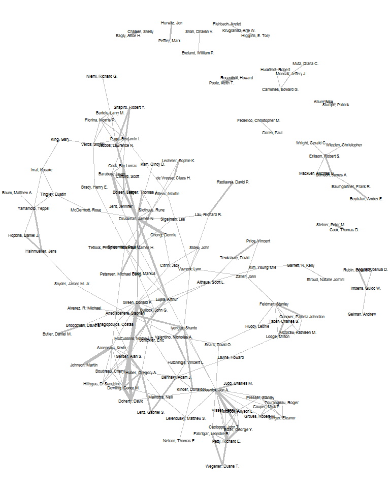

Another, more interactive way of doing this might be:

``` r
networkD3::simpleNetwork(topco)
d3 <- networkD3::igraph_to_networkD3(cograph)
d3$nodes$group <- 1L
networkD3::forceNetwork(Links = d3$links, Nodes = d3$nodes, NodeID = "name", Group = "group")
```

Betweenness centrality of top 25 authors:

``` r
between <- igraph::betweenness(cograph)
topcoaut <- na.omit(data.frame(betweenness = head(sort(between, decreasing = TRUE), 30)))
topcoaut$aut <- factor(rownames(topcoaut), levels = rev(rownames(topcoaut)))
ggplot(topcoaut, aes(x = aut, y = betweenness)) + 
  geom_bar(stat = "identity") + 
  ylab("Network Betweenness") + 
  xlab("Author Name") + 
  coord_flip()
```

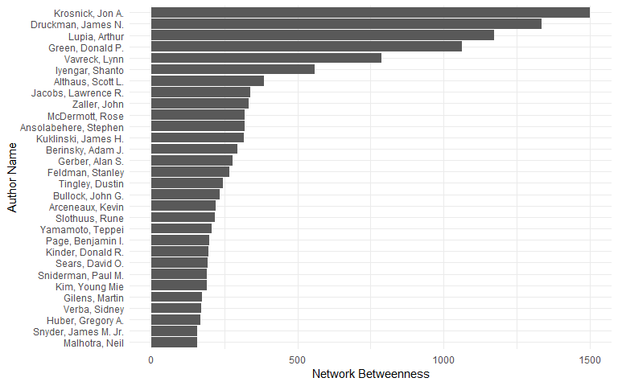

Publication Years
-----------------

Years of publication (post-1950):

``` r
ggplot(dat[!is.na(dat$YEAR) & dat$YEAR > 1950, ], aes(x = YEAR)) + 
  geom_bar() +
  xlab("Publication Year") + 
  ylab("Count")
```


Data missingness
----------------

Proportion missing data, by field, for articles:

``` r
articles <- dat[dat$CATEGORY == "ARTICLE", c("AUTHOR", "TITLE", "JOURNAL", "YEAR", "VOLUME", "NUMBER", "PAGES", "ABSTRACT", "DOI")]
articles <- cbind.data.frame(FIELD = names(articles), MISSINGNESS = unlist(lapply(articles, function(x) sum(is.na(x) == TRUE)/length(x))))
ggplot(articles, aes(x = FIELD, y = MISSINGNESS)) +
  geom_bar(stat = "identity", fill = "darkgray") + 
  ylab("Proportion Missing") + 
  ylim(c(0,1)) +
  xlab("") + 
  coord_flip()
```

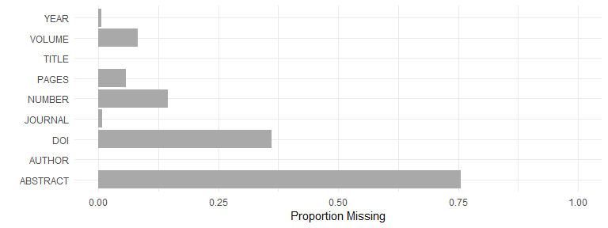

Proportion missing data, by field, for books:

``` r
books <- dat[dat$CATEGORY == "BOOK", c("AUTHOR", "EDITOR", "TITLE", "PUBLISHER", "YEAR", "ADDRESS", "ISBN")]
books <- cbind.data.frame(FIELD = names(books), MISSINGNESS = unlist(lapply(books, function(x) sum(is.na(x) == TRUE)/length(x))))
ggplot(books, aes(x = FIELD, y = MISSINGNESS)) +
  geom_bar(stat = "identity", fill = "darkgray") + 
  ylab("Proportion Missing") + 
  ylim(c(0,1)) +
  xlab("") + 
  coord_flip()
```

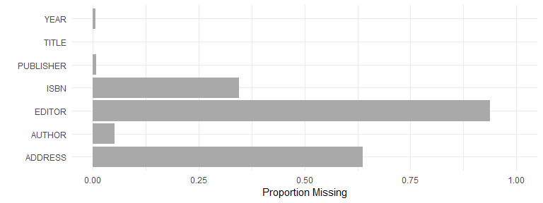
